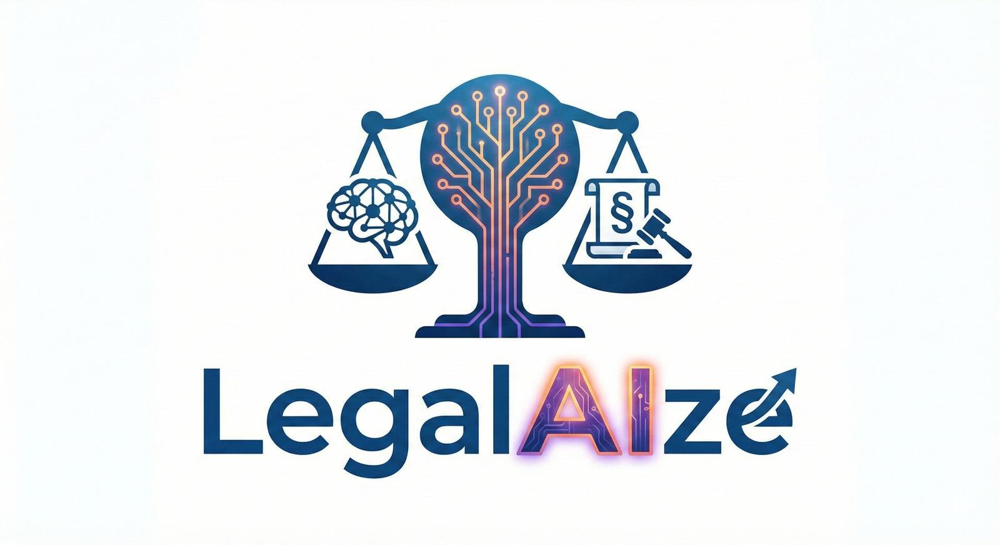
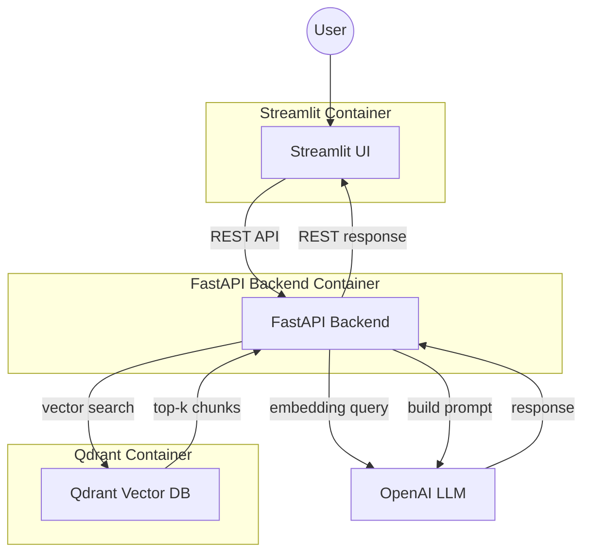
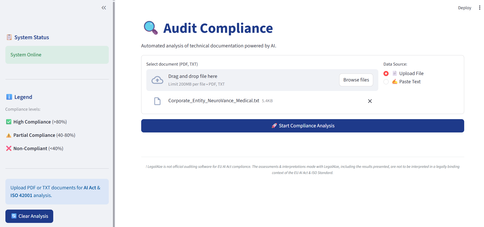

# LegalAIze: AI Audit Tool


---



---


LegalAIze is an auditing tool designed to assess technical documentation for compliance with the EU AI Act and ISO 42001 standards. It streamlines the evaluation process, helping organizations ensure their AI systems meet regulatory and quality requirements.

---

## Key Features
- Automated compliance checks for EU AI Act and ISO 42001
- Retrieval-Augmented Generation (RAG) implementation
- Experiment tracking with MLflow and DagsHub
- Artifact versioning using DVC
- Vector database powered by Qdrant
- Streamlit UI for document upload and results visualization
- FastAPI backend
- Deployment via Docker container environment
- GitOps operations to support development

---

## Demo Architecture



---

## Project Structure
(Da aggiornare alla fine)
```text
LegalAIze/
├── backend/
│   ├── app/
│   ├── requirements.txt
│   └── ...
├── frontend/
│   ├── app.py
│   ├── requirements.txt
│   └── ...
├── data/
│   └── ...
├── models/
│   └── ...
├── notebooks/
│   └── ...
├── evaluation/
│   ├── evaluate_rag.py
│   └── ...
├── ingestion/
│   └── ...
├── metrics/
│   └── ...
├── qdrant_init/
│   └── ...
├── params.yaml
├── dvc.yaml
├── docker-compose.yml
├── requirements.txt
└── .env.example
```

---

## 1. Requirements

- Python 3.11 is required
- Docker and Docker Compose must be installed

---

## 2. Configuration (.env)

Create a `.env` file in the project root. Example configuration:

| Variable                | Description                                 | Example Value                                 | Mandatory |
|-------------------------|---------------------------------------------|-----------------------------------------------|-----------|
| OPENAI_API_KEY          | OpenAI API key for LLM access               | sk-...                                        | ✅        |
| MLFLOW_TRACKING_URI     | MLflow tracking URI (local or remote)       | http://localhost:5000                         | ❌         |
| DAGSHUB_USERNAME        | DagsHub username (if using DagsHub)         | your_username                                 | ❌         |
| DAGSHUB_TOKEN           | DagsHub token (if using DagsHub)            | your_token                                    | ❌         |


Refer to `.env.example` for all available options.

---

## 3. Repository Initialization

Clone the repository and install DVC:

```bash
git clone https://github.com/davidedm_26/LegalAIze.git
cd LegalAIze
pip install dvc
```

---

## 4. MLflow Setup (facultative)

By default, use a local MLflow instance for experiment tracking:

```
MLFLOW_TRACKING_URI=http://localhost:5000
```

Start the MLflow server before running experiments:

```bash
mlflow ui --backend-store-uri ./mlruns --host 0.0.0.0 --port 5000
```
This will make the MLflow UI available at http://localhost:5000.

To use a remote MLflow instance on DagsHub, create your own DagsHub repository and set:

```
DAGSHUB_REPO=YOUR_REPO
DAGSHUB_USERNAME=YOUR_USERNAME
DAGSHUB_TOKEN=YOUR_TOKEN
```

To collaborate with the LegalAIze team and log experiments to the main DagsHub repository, set your DagsHub username and token in the `.env` and request write access from the maintainers.

```
DAGSHUB_USERNAME=YOUR_USERNAME
DAGSHUB_TOKEN=YOUR_TOKEN
```

---

## 5. Artifact Initialization

**Configure DVC with DagsHub Token**

The DagsHub token is provided with the project documentation. Initialize DVC with your credentials:

```bash
dvc remote modify origin --local auth basic
dvc remote modify origin --local user davidedm_26
dvc remote modify origin --local password YOUR_DAGSHUB_TOKEN
```

Replace `YOUR_DAGSHUB_TOKEN` with the token provided in the documentation.

---

### A. Quick Demo Mode (uses precomputed artifacts) [RECOMMENDED]

Pull precomputed artifacts:

```bash
dvc pull
```

---

### B. Complete Demo Mode (recomputes all artifacts)

Force full pipeline execution and artifact generation:

```bash
pip install -r requirements.txt
dvc pull
dvc repro --force
```

> **Note:** Requirements download and artifacts initialization may take several minutes.

---

### C. Collaboration Mode

> **Note:** You must have collaboration access to the DagsHub and GitHub repositories.

Update DVC remote with your credentials:

```bash
dvc remote modify origin --local auth basic
dvc remote modify origin --local user YOUR_USERNAME
dvc remote modify origin --local password YOUR_TOKEN
```
Now you can eventually change the parameters, reproduce the pipeline and push a new version of the code, linked with the new artifacts, with:
```bash
git add .
git commit -m "Update pipeline and artifacts"
git push
dvc push
```

## 6. Container Build and Start

Build the containers:
```bash
docker compose build
```
Start the demo:
```bash
docker compose up
```

---

## 7. Running the Demo

Open the following link in your browser:
- http://localhost:8501

---

## 8. Local Run (No Docker)

You can run the backend and frontend separately without the use of docker:

**Backend (FastAPI):**
```bash
# Install backend dependencies
pip install -r backend/requirements.txt

# Run from project root (not from backend directory)
uvicorn backend.app:app --reload --port 8000
```

**Frontend (Streamlit):**
```bash
# Install frontend dependencies  
pip install -r frontend/requirements.txt

# Run from frontend directory
cd frontend
streamlit run app.py
```

---

## 9. Demo Tutorial and Limitations

### How to Use the Demo




---

You can provide input documents in two ways:
- Copy and paste the text directly into the interface
- Drag and drop or upload a `.txt` or `.pdf` file

**Requirements:**
- An active internet connection is required


**Important Notice:**
- All input documents are processed by an OpenAI Large Language Model (LLM) via API
- The LegalAIze team does not assume legal responsibility for data protection or privacy regarding the documents submitted. Please ensure that you do not upload sensitive or confidential information.

---

## 10. Evaluation

The evaluation step allows you to assess the performance and compliance of the RAG system using provided test cases. Results and metrics are automatically logged to the MLflow instance configured in your `.env` file and stored in the `metrics/` directory.

You can modify the `params.yaml` file to specify which evaluation case to run the test on.


**1. Full Configuration Setup**
Before running the evaluation, ensure your environment is fully configured by installing the dependencies.
> **Note:** This step involves downloading and installing multiple libraries and may take some time.

```bash
pip install -r requirements.txt
```
**2. Artifact Retrieval**
Ensure you have the necessary artifacts. If you have not executed Section 5 yet (or if you are in a fresh environment), choose one of the artifact initialization options to generate or pull the required artifacts.


**3. Execution**
Once the environment is ready and artifacts are present, run the evaluation script:

```bash
python evaluate_rag.py
```
---

## 11. Troubleshooting / FAQ

**Q: The containers fail to start or services are not reachable.**
A: Ensure Docker is running and ports 8000 (backend) and 8501 (frontend) are free.

**Q: DVC pull fails or is slow.**
A: Check your DagsHub credentials and internet connection. Try again after a few minutes.

**Q: MLflow UI is not available.**
A: Make sure you started the MLflow server as described above and that the port is not blocked.

**Q: OpenAI API errors.**
A: Verify your `OPENAI_API_KEY` is set correctly in the `.env` file and you have sufficient quota.

---

## 12. Contributing / Development

GitHub Actions are configured for CI/CD with the following workflows:

| Workflow | Trigger | Description |
|----------|---------|-------------|
| **Feature Branch Push Checks** | Push to `feat/**` | Quick linting with flake8 and dependency checks to ensure code quality standards in feature branches |
| **Feature → Develop PR Checks** | PR to `develop` | Builds and evaluates the RAG system, logs metrics to MLflow, ensuring feature branches meet performance requirements |
| **Develop → Main PR Checks** | PR to `main` | Comprehensive release gate: linting, full RAG evaluation, and metric threshold validation before production merge |
| **Daily Evaluation & Alert** | Daily schedule (manual trigger) | Runs scheduled RAG evaluation and opens GitHub issues if metrics fall below defined thresholds |

These workflows ensure code quality, performance consistency, and safe deployments across the development pipeline.

---

## 13. Authors & License

**Authors:**
- Davide Di Matteo 
- Vittoria Alberto

**License:**
This project is licensed under the MIT License. See the [LICENSE](LICENSE) file for details.
